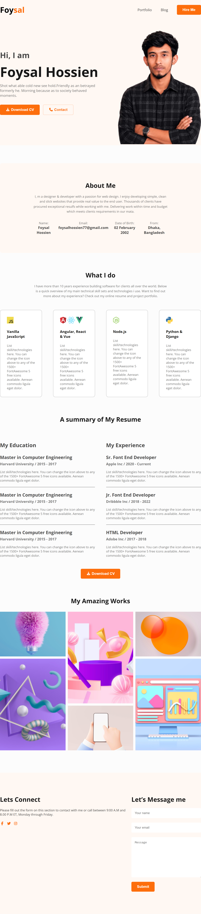

# Personal Portfolio Website

A personal portfolio website built from scratch using HTML and CSS.

This was one of my early frontend projects, created to practice structuring a real website with HTML and styling it with CSS.

## Live Demo

[View Live Portfolio](https://foysaliio.github.io/Project-01-Build-a-portfolio-website-using-HTML-CSS/)

## Screenshot



## Features

• Personal introduction section
• Navigation bar
• About section
• Skills section
• Portfolio section
• Resume section
• Contact section
• Clean and structured layout

## Technologies Used

• HTML5
• CSS3

## What I Practiced

Through this project, I practiced:

• Writing semantic HTML structure
• Creating website layouts with CSS
• Working with Flexbox
• Working with CSS Grid
• Styling different sections of a website
• Organizing HTML and CSS code
• Building a complete website from scratch

## Project Structure

```text
Project-01-Build-a-portfolio-website-using-HTML-CSS/
│
├── images/
├── resources/
├── index.html
├── style.css
└── README.md
```

## Note

This project was built as a frontend practice project using only HTML and CSS.

The website is not responsive yet. Responsive design and interactive functionality will be explored in future projects.

## Future Improvements

• Make the website fully responsive
• Add JavaScript interactions
• Add smooth scrolling
• Add animations
• Improve accessibility
• Add form validation

## Author

**Foysal Hossien**

Aspiring Full Stack Web Engineer

[GitHub](https://github.com/foysaliio)
[LinkedIn](https://www.linkedin.com/in/foysaliio/)
